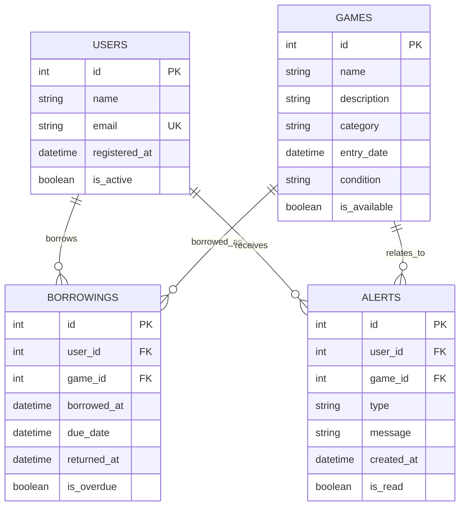

# Design Document

## Overview

The Board Game Library Management System is designed as a single-binary Go application that serves a responsive web interface and manages data through SQLite. The architecture follows a clean, layered approach with clear separation between the web layer, business logic, and data persistence. The system uses server-side rendering with HTMX for dynamic interactions, ensuring a responsive experience without complex client-side JavaScript frameworks.

## Architecture

The application follows a three-tier architecture:

```
┌─────────────────────────────────────┐
│           Web Layer                 │
│  (Gin Router + HTML Templates)     │
└─────────────────────────────────────┘
                  │
┌─────────────────────────────────────┐
│         Service Layer               │
│    (Business Logic + Validation)   │
└─────────────────────────────────────┘
                  │
┌─────────────────────────────────────┐
│       Repository Layer              │
│     (SQLite + Data Access)         │
└─────────────────────────────────────┘
```

### Technology Stack
- **Backend**: Go 1.21+ with Gin web framework
- **Database**: SQLite with database/sql and sqlite3 driver
- **Frontend**: HTML templates, HTMX for interactivity, Tailwind CSS for styling
- **Build**: Single binary deployment with embedded assets

## Components and Interfaces

### Core Models

```go
type User struct {
    ID           int       `json:"id" db:"id"`
    Name         string    `json:"name" db:"name"`
    Email        string    `json:"email" db:"email"`
    RegisteredAt time.Time `json:"registered_at" db:"registered_at"`
    IsActive     bool      `json:"is_active" db:"is_active"`
}

type Game struct {
    ID          int       `json:"id" db:"id"`
    Name        string    `json:"name" db:"name"`
    Description string    `json:"description" db:"description"`
    Category    string    `json:"category" db:"category"`
    EntryDate   time.Time `json:"entry_date" db:"entry_date"`
    Condition   string    `json:"condition" db:"condition"`
    IsAvailable bool      `json:"is_available" db:"is_available"`
}

type Borrowing struct {
    ID         int        `json:"id" db:"id"`
    UserID     int        `json:"user_id" db:"user_id"`
    GameID     int        `json:"game_id" db:"game_id"`
    BorrowedAt time.Time  `json:"borrowed_at" db:"borrowed_at"`
    DueDate    time.Time  `json:"due_date" db:"due_date"`
    ReturnedAt *time.Time `json:"returned_at" db:"returned_at"`
    IsOverdue  bool       `json:"is_overdue" db:"is_overdue"`
}

type Alert struct {
    ID        int       `json:"id" db:"id"`
    UserID    int       `json:"user_id" db:"user_id"`
    GameID    int       `json:"game_id" db:"game_id"`
    Type      string    `json:"type" db:"type"` // "overdue", "reminder"
    Message   string    `json:"message" db:"message"`
    CreatedAt time.Time `json:"created_at" db:"created_at"`
    IsRead    bool      `json:"is_read" db:"is_read"`
}
```

### Repository Interfaces

```go
type UserRepository interface {
    Create(user *User) error
    GetByID(id int) (*User, error)
    GetAll() ([]*User, error)
    Update(user *User) error
    Delete(id int) error
    GetBorrowingHistory(userID int) ([]*Borrowing, error)
}

type GameRepository interface {
    Create(game *Game) error
    GetByID(id int) (*Game, error)
    GetAll() ([]*Game, error)
    Search(query string) ([]*Game, error)
    Update(game *Game) error
    Delete(id int) error
    GetAvailable() ([]*Game, error)
}

type BorrowingRepository interface {
    Create(borrowing *Borrowing) error
    GetByID(id int) (*Borrowing, error)
    GetActiveByUser(userID int) ([]*Borrowing, error)
    GetOverdue() ([]*Borrowing, error)
    Update(borrowing *Borrowing) error
    ReturnGame(borrowingID int) error
}

type AlertRepository interface {
    Create(alert *Alert) error
    GetUnread() ([]*Alert, error)
    GetByUser(userID int) ([]*Alert, error)
    MarkAsRead(id int) error
    Delete(id int) error
}
```

### Service Layer

```go
type UserService interface {
    RegisterUser(name, email string) (*User, error)
    GetUser(id int) (*User, error)
    GetAllUsers() ([]*User, error)
    GetUserBorrowings(userID int) ([]*Borrowing, error)
    CanUserBorrow(userID int) (bool, error)
}

type GameService interface {
    AddGame(name, description, category, condition string) (*Game, error)
    GetGame(id int) (*Game, error)
    GetAllGames() ([]*Game, error)
    SearchGames(query string) ([]*Game, error)
    UpdateGame(game *Game) error
}

type BorrowingService interface {
    BorrowGame(userID, gameID int, dueDate time.Time) (*Borrowing, error)
    ReturnGame(borrowingID int) error
    GetOverdueItems() ([]*Borrowing, error)
    ExtendDueDate(borrowingID int, newDueDate time.Time) error
}

type AlertService interface {
    GenerateOverdueAlerts() error
    GenerateReminderAlerts() error
    GetActiveAlerts() ([]*Alert, error)
    MarkAlertAsRead(alertID int) error
}
```

## Data Models

### Database Schema

```sql
-- Users table
CREATE TABLE users (
    id INTEGER PRIMARY KEY AUTOINCREMENT,
    name TEXT NOT NULL,
    email TEXT UNIQUE NOT NULL,
    registered_at DATETIME DEFAULT CURRENT_TIMESTAMP,
    is_active BOOLEAN DEFAULT TRUE
);

-- Games table
CREATE TABLE games (
    id INTEGER PRIMARY KEY AUTOINCREMENT,
    name TEXT NOT NULL,
    description TEXT,
    category TEXT,
    entry_date DATETIME DEFAULT CURRENT_TIMESTAMP,
    condition TEXT DEFAULT 'good',
    is_available BOOLEAN DEFAULT TRUE
);

-- Borrowings table
CREATE TABLE borrowings (
    id INTEGER PRIMARY KEY AUTOINCREMENT,
    user_id INTEGER NOT NULL,
    game_id INTEGER NOT NULL,
    borrowed_at DATETIME DEFAULT CURRENT_TIMESTAMP,
    due_date DATETIME NOT NULL,
    returned_at DATETIME,
    is_overdue BOOLEAN DEFAULT FALSE,
    FOREIGN KEY (user_id) REFERENCES users(id),
    FOREIGN KEY (game_id) REFERENCES games(id)
);

-- Alerts table
CREATE TABLE alerts (
    id INTEGER PRIMARY KEY AUTOINCREMENT,
    user_id INTEGER NOT NULL,
    game_id INTEGER NOT NULL,
    type TEXT NOT NULL, -- 'overdue', 'reminder'
    message TEXT NOT NULL,
    created_at DATETIME DEFAULT CURRENT_TIMESTAMP,
    is_read BOOLEAN DEFAULT FALSE,
    FOREIGN KEY (user_id) REFERENCES users(id),
    FOREIGN KEY (game_id) REFERENCES games(id)
);

-- Indexes for performance
CREATE INDEX idx_borrowings_user_id ON borrowings(user_id);
CREATE INDEX idx_borrowings_game_id ON borrowings(game_id);
CREATE INDEX idx_borrowings_due_date ON borrowings(due_date);
CREATE INDEX idx_alerts_user_id ON alerts(user_id);
CREATE INDEX idx_alerts_is_read ON alerts(is_read);
```

### Data Relationships



## Error Handling

### Error Types

```go
type AppError struct {
    Code    string `json:"code"`
    Message string `json:"message"`
    Details string `json:"details,omitempty"`
}

// Common error codes
const (
    ErrUserNotFound     = "USER_NOT_FOUND"
    ErrGameNotFound     = "GAME_NOT_FOUND"
    ErrGameNotAvailable = "GAME_NOT_AVAILABLE"
    ErrUserHasOverdue   = "USER_HAS_OVERDUE"
    ErrInvalidInput     = "INVALID_INPUT"
    ErrDatabaseError    = "DATABASE_ERROR"
)
```

### Error Handling Strategy

1. **Repository Layer**: Return specific database errors
2. **Service Layer**: Convert to business logic errors with context
3. **Web Layer**: Transform to appropriate HTTP status codes and user-friendly messages
4. **Logging**: Structured logging with error context and stack traces
5. **User Feedback**: Clear, actionable error messages in the UI

## Testing Strategy

### Unit Testing
- **Repository Tests**: Use in-memory SQLite database for isolated testing
- **Service Tests**: Mock repository dependencies using interfaces
- **Handler Tests**: Use httptest package for HTTP endpoint testing
- **Model Tests**: Validate data structures and business rules

### Integration Testing
- **Database Integration**: Test with real SQLite database
- **End-to-End Workflows**: Test complete borrowing/return cycles
- **Alert Generation**: Test scheduled alert creation processes

### Test Structure
```
tests/
├── unit/
│   ├── repositories/
│   ├── services/
│   └── handlers/
├── integration/
│   ├── database/
│   └── workflows/
└── fixtures/
    ├── users.json
    ├── games.json
    └── borrowings.json
```

### Performance Testing
- **Database Query Performance**: Ensure queries scale with data growth
- **Concurrent Access**: Test multiple users accessing the system simultaneously
- **Memory Usage**: Monitor memory consumption during extended usage

### Testing Tools
- **Testing Framework**: Go's built-in testing package
- **Assertions**: testify/assert for cleaner test assertions
- **Mocking**: testify/mock for interface mocking
- **Database**: SQLite in-memory mode for fast test execution